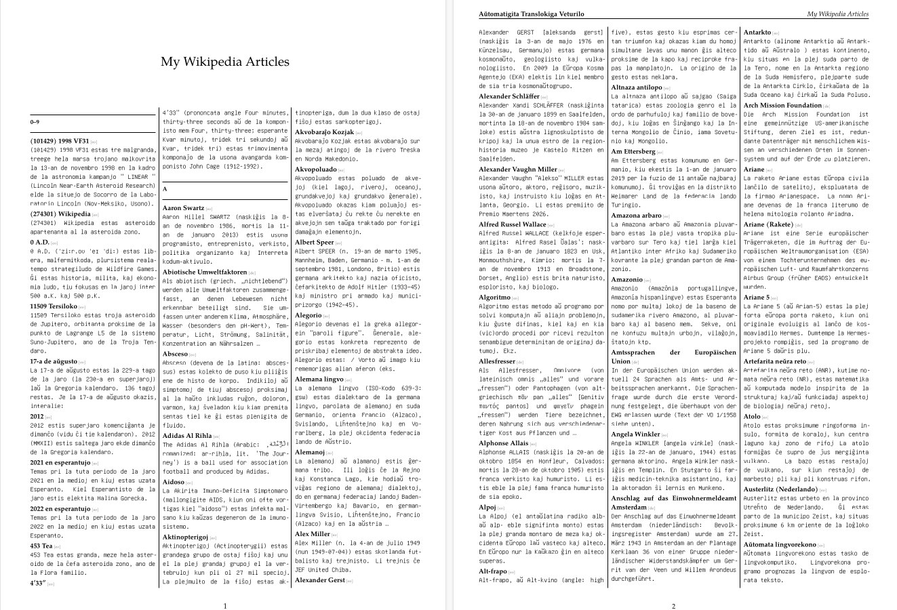

# My Wikipedia Book — Articles I've Edited

This is a small idea developped during Wikimania 2026.

The scripts in this repo generate a printed collection of every article (across all languages) that
a given Wikimedia user has edited over time. Only the first paragraph is used, the result looks similar to a classic printed encyclopedia.



## Workflow

```bash
pip install requests

# 1. Test run: only 5 articles per discovered wiki
python wiki_contributions_import.py --user "Your Username" --db contributions.db --limit 5

# 2. Full import across every Wikipedia language edition the account has edited
python wiki_contributions_import.py --user "Your Username" --db contributions.db

# 3. Generate the PDF source
python wiki_contributions_generate_latex.py --db contributions.db --out my_book.tex --title "My Wikipedia Articles" --author "Your Name"

# 4. Compile
xelatex my_book.tex   # run twice for correct headers
```

## How the import works

Wikimedia accounts are normally unified across all wikis via SUL (Single
User Login). `wiki_contributions_import.py` first queries
`meta.wikimedia.org` (`action=query&meta=globaluserinfo&guiprop=merged`) to
find out which wikis the account exists on and has edits on. By default
only Wikipedia language editions are considered (`--all-projects` also
includes Wiktionary, Wikisource, etc.).

For each discovered wiki, `list=usercontribs` (main namespace) is queried
to collect every article ever edited — including edit count and the
timestamp of the user's first and last edit to it. For each article, the
intro text and categories are then fetched, and redirects are resolved.

**Note:** Articles that have since been deleted (page no longer exists) are
automatically skipped. Articles where your only contribution was later
reverted still show up — the contribution list reflects all *your* edits,
regardless of the article's current state.

## Database schema

Table `articles`, unique key `(wiki_lang, wiki_project, title)`:

| Column | Description |
|---|---|
| `title` | Article title in the respective language |
| `wiki_lang` | Language code, e.g. `de`, `en`, `eo`, `ru` |
| `wiki_project` | `wikipedia`, `wiktionary`, ... |
| `text` / `text_edited` | Original vs. edited intro text |
| `extra_latex` | Freely editable, inserted unchanged into the PDF (images, infoboxes — same commands as the original project) |
| `sort_key` | Diacritic-stripped, normalized for language-neutral sorting |
| `edit_count` | Number of your own edits to this article |
| `first_edited_at` / `last_edited_at` | Timestamps of your own edits |
| `comment` | `duplicate` if a redirect led to an article already present |

`text_edited` can be filled in manually (it's
never truncated automatically), and `extra_latex` still supports
`\entryimage{}{}` and `\begin{infobox}{}...\end{infobox}`.

## LaTeX generator: sorting/grouping options

`--group-by`:
- `alpha` (default): one shared alphabet across all languages; non-Latin
  scripts (Cyrillic, Greek, CJK, ...) group under their own first
  character as their own section.
- `lang`: one chapter per language (in the order they occur in the
  database), sorted alphabetically within each chapter.
- `date`: chronological by the timestamp of your first edit — effectively
  a diary of your Wikipedia journey.

Every entry additionally shows a small `[language code]` tag next to the
title.

## Layout

Three-column A4 layout (`\begin{multicols}{3}`), 7pt body text, since a
three-column layout needs a smaller font size than two columns to keep
line lengths readable.

## Known limitations

- Sorting is a pragmatic, language-neutral compromise (see above) — not a
  linguistically correct per-language collation.
- Very active accounts with tens of thousands of edits will generate a
  correspondingly large number of API requests; consider restricting
  `--wikis` or letting it run overnight.
- Fonts (TeX Gyre Pagella, Unifont) need to be installed, same as in the
  original project:
  ```bash
  sudo apt install texlive-fonts-recommended fonts-unifont fonts-noto-core
  sudo updmap-sys
  ```
